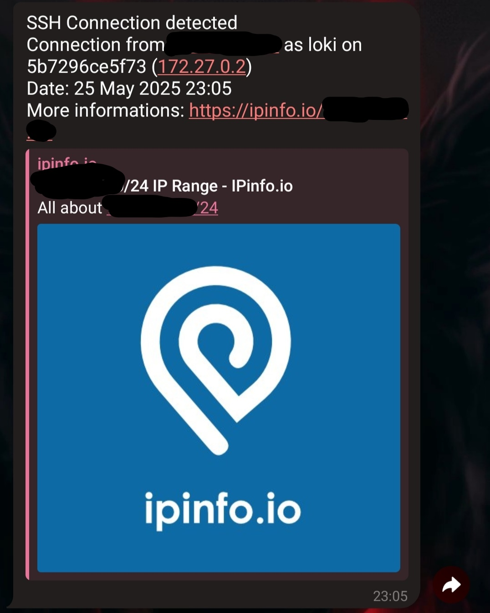
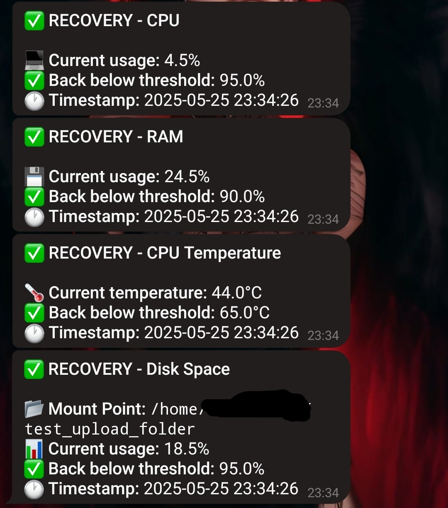
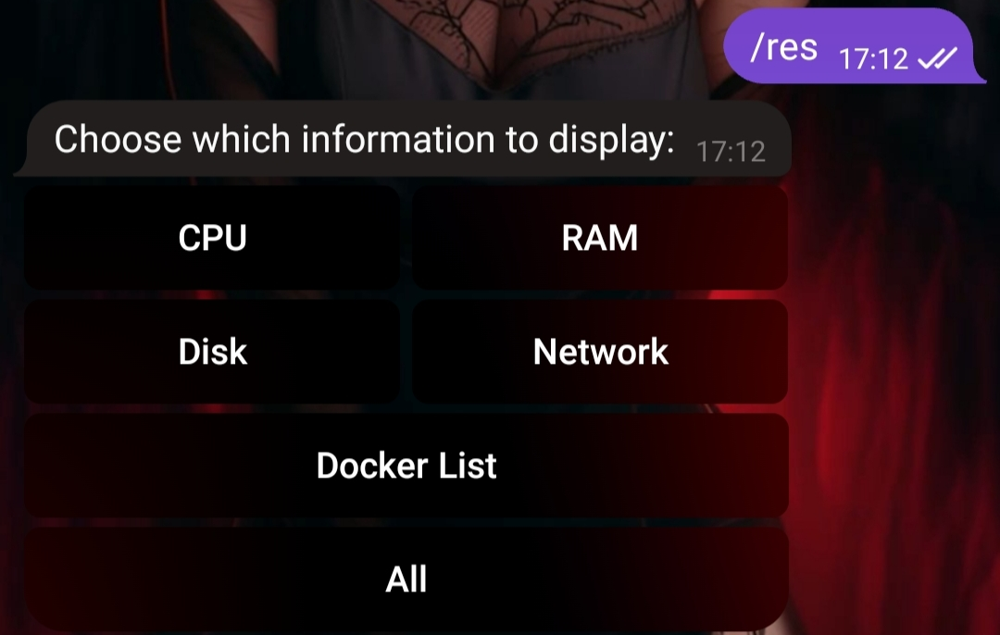
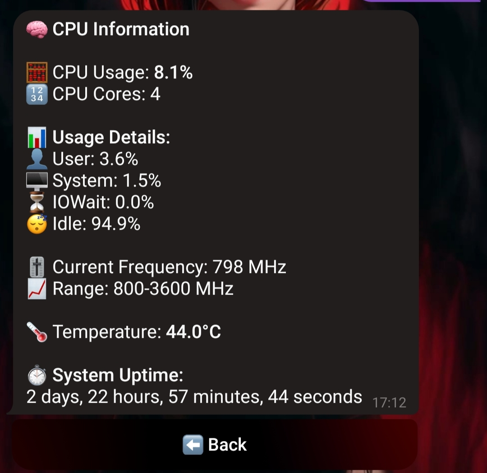
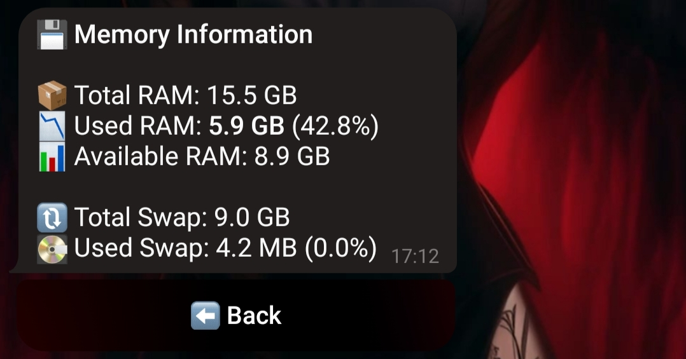
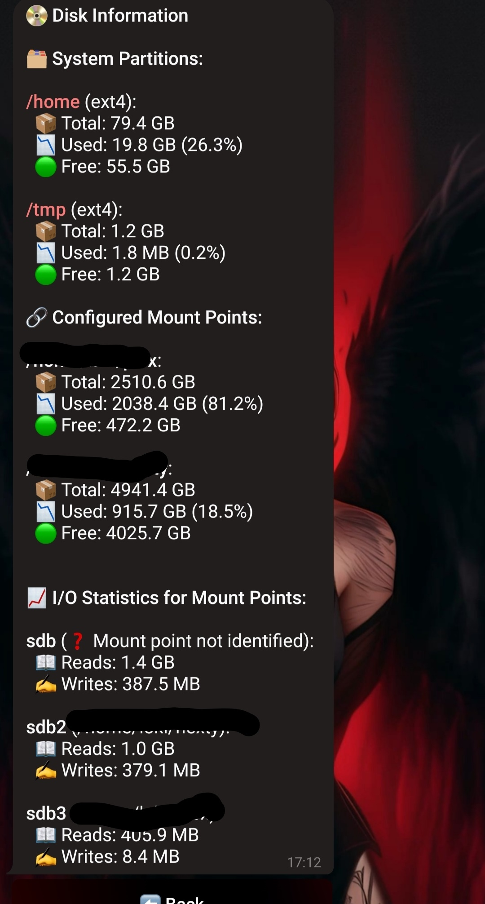
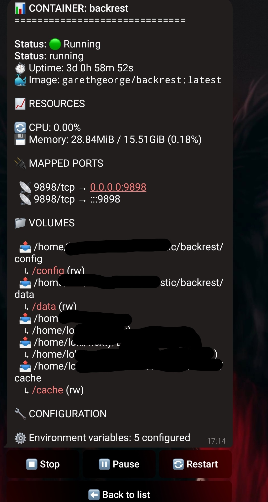
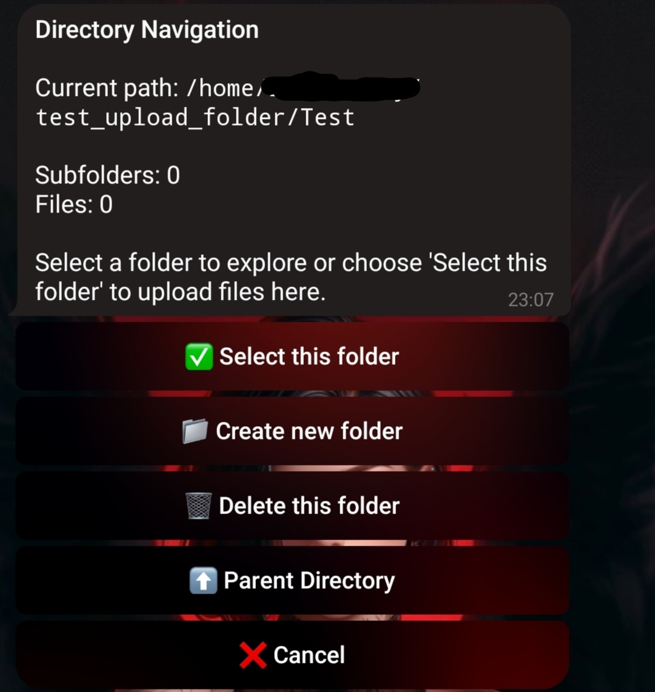

## 🟢⚪🔴 *For English version, click here:* [README English](README.md)

# 🖥️ Telegram Server Monitor  
**WebApp Dockerizzata + Bot Telegram per il Monitoraggio e il Controllo Remoto del Server**

Telegram Server Monitor è un'applicazione completamente containerizzata che fornisce una GUI web e un bot Telegram per monitorare e gestire il tuo server Linux. Fornisce notifiche in tempo reale su accessi SSH/SFTP, utilizzo delle risorse di sistema, connettività internet e gestione dei container Docker. La soluzione consente sia il monitoraggio che il controllo remoto direttamente dal browser o da Telegram.

---
## 🌐 Funzionalità della GUI Web

La GUI è organizzata in schede per una gestione semplice e chiara:

<div align="center">
   
 ### 📸 CLICCA   PER   VEDERE   SCREENSHOT DELLA GUI
<details>
   
</details>
</div>

### 📊 Monitoraggio
- Tiene traccia delle connessioni SSH/SFTP.
- Invia notifiche Telegram istantanee per ogni nuovo accesso, inclusi dettagli come indirizzo IP esterno, nome utente, nome host, IP interno, timestamp e link a maggiori informazioni sull'IP (tramite ipinfo.io).
  
<div align="center">
   
 ### 📸 CLICCA   PER   VEDERE   SCREENSHOT DELLA GUI
<details>
   
</details>
</div>
<div align="center">
   
 ### 📸 CLICCA   PER   VEDERE   SCREENSHOT DEL BOT
<details>
   
</details>
</div>

### 🤖 Telegram
- Imposta il Token del Bot Telegram e l'ID della Chat.
- Visualizza l'elenco completo dei comandi supportati.
  
<div align="center">
   
 ### 📸 CLICCA   PER   VEDERE   SCREENSHOT DELLA GUI
<details>
   
</details>
</div>

### 🚨 Avvisi di Sistema
- Abilita/disabilita il monitoraggio del sistema.
- Visualizza metriche in tempo reale: CPU, RAM, temperatura CPU, stato dei punti di mount.
- Configura soglie di allarme per CPU, RAM, temperatura CPU e spazio su disco.
- Abilita i promemoria per stati di allarme persistenti.
- Invia una nuova notifica quando una soglia precedentemente superata torna alla normalità.
- Monitora la connessione a Internet con notifiche di disconnessione/riconnessione.

<div align="center">
   
 ### 📸 CLICCA   PER   VEDERE   SCREENSHOT DELLA GUI
<details>
   
</details>
</div>
<div align="center">
   
 ### 📸 CLICCA   PER   VEDERE   SCREENSHOT DELLA GUI
<details>
   
</details>
</div>
<div align="center">
   
 ### 📸 CLICCA   PER   VEDERE   SCREENSHOT DELLA GUI
<details>
   
</details>
</div>

### 📂 Punti di Mount
- Gestisci i punti di mount usati dai comandi del bot Telegram:
  - `/upload` (directory da cui caricare file)
  - `/download` (directory in cui scaricare file)
- Utilizzati anche per monitorare l’uso del disco e generare avvisi quando vengono superate le soglie di spazio.

<div align="center">
   
 ### 📸 CLICCA   PER   VEDERE   SCREENSHOT DELLA GUI
<details>
   
</details>
</div>

### 🌍 Lingue
- Gestisci la lingua dell’interfaccia e del bot.
- Carica file JSON per aggiungere nuove lingue.
- Cambia dinamicamente la lingua attiva per GUI e bot.
- Tutte le etichette dei pulsanti e i messaggi di allerta (sia nel bot che nella GUI) sono completamente personalizzabili tramite i file lingua in JSON.

<div align="center">
   
 ### 📸 CLICCA   PER   VEDERE   SCREENSHOT DELLA GUI
<details>
   
</details>
</div>


---
## 🤖 Funzionalità del Bot Telegram
Utilizza il bot Telegram per interagire con il server direttamente dal telefono o dal PC. Ecco i comandi principali per monitoraggio e controllo:
- `/start` – Inizializza il bot e ricevi un messaggio di benvenuto.
- `/help` – Elenca tutti i comandi disponibili con descrizione.
- `/res` – Mostra l’utilizzo attuale delle risorse di sistema (CPU, RAM, disco, rete).
- `/docker` – Visualizza e gestisci i container Docker (elenco, avvia, ferma, metti in pausa).
- `/upload` – Carica file da Telegram alla directory del server configurata.
- `/download` – Scarica file dal server a Telegram.
- `/reboot` – Riavvia in sicurezza il server.

<div align="center">
   
 ### 📸 COMANDI DEL BOT TELEGRAM
<details>
   
</details>
</div>


### 🛡️ Notifiche  
Ricevi avvisi in tempo reale per:  
- Accessi SSH/SFTP  
- Soglie superate per CPU, RAM, temperatura  
- Spazio su disco  
- Ritorno della connettività Internet  


<div align="center">
   
 ### 📸 NOTIFICA SSH
<details>
   
</details>
</div>


<div align="center">
   
 ### 📸 NOTIFICA CPU, TEMP_CPU, RAM & DISK
<details>
   
</details>
</div>


<div align="center">
   
 ### 📸 NOTIFICA RIPRISTINO CPU, TEMP_CPU, RAM & DISK
<details>
   
</details>
</div>

### 📊 Comandi di Monitoraggio del Sistema  
Ottieni via bot lo stato attuale di CPU, RAM, utilizzo disco e rete.


<div align="center">
   
 ### 📸 COMANDO RISORSE
<details>
   
</details>
</div>


<div align="center">
   
 ### 📸 TELEMETRIA CPU
<details>
   
</details>
</div>


<div align="center">
   
 ### 📸 TELEMETRIA RAM
<details>
   
</details>
</div>

<div align="center">
   
 ### 📸 TELEMETRIA DISCO
<details>
   
</details>
</div>


<div align="center">
   
 ### 📸 TELEMETRIA RETE
<details>
   
</details>
</div>


<div align="center">
   
 ### 📸 GESTIONE CONTAINER
<details>
   
</details>
</div>

### 🐳 Gestione dei Container Docker  
- Elenca i container in esecuzione  
- Avvia, metti in pausa e ferma i container  
- Visualizza configurazione dei container

<div align="center">
   
 ### 📸 COMANDO DOCKER
<details>
   
</details>
</div>


<div align="center">
   
 ### 📸 GESTORE CONTAINER
<details>
   
</details>
</div>


### 📂 Operazioni sui File  
Carica e scarica file dal/al server tramite i punti di mount configurati, direttamente dal bot Telegram.
 - Il comando `/upload` permette di:
       - Navigare tra le cartelle
       - Creare nuove cartelle
       - Eliminare cartelle
       - Caricare file nel Server
 - Il comando `/download` permette di:
       - Scaricare file dal Server
   
<div align="center">
   
 ### 📸 COMANDO UPLOAD
<details>
   
</details>
</div>

<div align="center">
   
 ### 📸 COMANDO DOWNLOAD
<details>
   
</details>
</div>

### 🔁 Controllo del Server  
Riavvia il server usando un comando dedicato del bot.

<div align="center">
   
 ### 📸 COMANDO REBOOT
<details>
   
</details>
</div>


---
## 🛠️ Requisiti

- Docker e Docker Compose installati su un server Linux (Debian/Ubuntu consigliati).
- Token del Bot Telegram (creane uno tramite [@BotFather](https://t.me/BotFather)).
- ChatID Telegram (ottienilo da [@myidbot](https://t.me/IDBot))
---  
## 📦 Installazione

1. **Clona il repository:**:
   ```bash
   git clone https://github.com/savergiggio/Server-Monitoring-Telegram-Bot-System.git
   cd Server-Monitoring-Telegram-Bot-System

2. **Modifica docker-compose.yml prima di eseguire (altamente consigliato):**:
   
     - *Monta le tue directory locali da usare come punti di mount nell'app, per upload/download file:*
     - *Cambia il mapping della porta predefinita (es. 8082:5000) se necessario per evitare conflitti.*
     - *Imposta il tuo fuso orario nelle variabili d'ambiente:*
     - *Specifica il tuo IP locale nella configurazione o nell’ambiente, se richiesto per la comunicazione del bot.*
   
   ```bash
   
    volumes:
    #UPLOADS
       - /home/user/folder1_upload:/home/user/folder1_upload
    #DOWNLOADS
       - /home/user/folder2_download:/home/user/folder2_download
    environment:
       - TZ=Europe/Rome
       - LOCAL_IP=YOURLOCALIP
   
3. **Build e avvia l'app con Docker Compose:**:
   ```bash
   sudo docker-compose build
   sudo docker-compose up -d
4. **Accedi alla GUI Web nel tuo browser all’indirizzo:**:
   ```bash
   http://localhost:8082 (or your configured IP and port)

