## 🟢⚪🔴 *Per la versione italiana, clicca qui:* [README Italiano](README.it.md) 

## 📚 Index  
- 🖥️ [Telegram Server Monitor – Overview](#️-telegram-server-monitor)  
- 🌐 [Web GUI Features](#-web-gui-features)  
  - 📊 [Monitoring](#-monitoring)  
  - 🤖 [Telegram Settings](#-telegram)  
  - 🚨 [System Alert](#-system-alert)  
  - 📂 [Mount Points](#-mount-points)  
  - 🌍 [Languages](#-languages)  
- 🤖 [Telegram Bot Features](#-telegram-bot-features)  
  - 🛡️ [Notifications](#️-notifications)  
  - 📊 [System Monitoring Commands](#-system-monitoring-commands)  
  - 🐳 [Docker Container Management](#-docker-container-management)  
  - 📂 [File Operations](#-file-operations)  
  - 🔁 [Server Control](#-server-control)  
- 🛠️ [Requirements](#️-requirements)  
- 📦 [Installation](#-installation)  

---

# 🖥️ Telegram Server Monitor  
**Dockerized WebApp + Telegram Bot for Remote Server Monitoring and Control**

Telegram Server Monitor is a fully containerized application that provides a web-based GUI and a Telegram bot to monitor and manage your Linux server. It delivers real-time notifications about SSH/SFTP access, system resource usage, internet connectivity, and Docker container management, upload and download of files from bot to server and viceversa. The solution enables both remote monitoring and control directly from your browser or Telegram.

---
## 🌐 Web GUI Features

The GUI is organized into tabs for simple and clear management:

<div align="center">
   
 ### 📸 CLICK   TO   VIEW  GUI SCREENSHOTS
<details>
   
</details>
</div>

### 📊 Monitoring
- Tracks SSH/SFTP connections.
- Sends instant Telegram notifications for each new login, including details such as the external IP address, username, host name, internal IP, timestamp, and a link to more information about the IP (via ipinfo.io).
  
<div align="center">
   
 ### 📸 CLICK   TO   VIEW  GUI SCREENSHOTS
<details>
   
</details>
</div>
<div align="center">
   
 ### 📸 CLICK   TO   VIEW  BOT SCREENSHOTS
<details>
   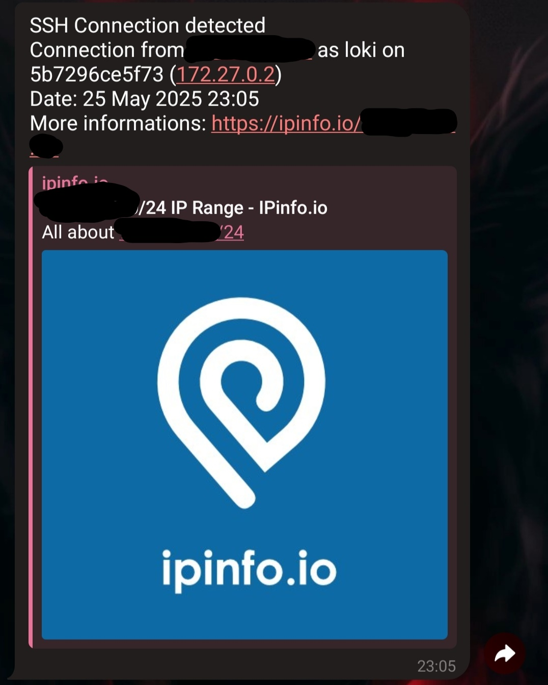
</details>
</div>

### 🤖 Telegram
- Set the Telegram Bot Token and Chat ID.
- View the complete list of supported commands.
  
<div align="center">
   
 ### 📸 CLICK   TO   VIEW  GUI SCREENSHOTS
<details>
   
</details>
</div>

### 🚨 System Alert
- Enable/disable system monitoring.
- View live metrics: CPU, RAM, CPU temperature, mount point status.
- Configure alert thresholds for CPU, RAM, CPU temperature, and disk space.
- Enable reminders for persistent alert states.
- Sends a new notification when a previously exceeded threshold returns to normal.
- Monitor internet connection with disconnection/reconnection notifications.

<div align="center">
   
 ### 📸 CLICK   TO   VIEW GUI SCREENSHOTS
<details>
   
</details>
</div>
<div align="center">
   
 ### 📸 CLICK   TO   VIEW GUI SCREENSHOTS
<details>
   
</details>
</div>
<div align="center">
   
 ### 📸 CLICK   TO   VIEW GUI SCREENSHOTS
<details>
   
</details>
</div>

### 📂 Mount Points
- Manage mount points used by Telegram bot commands:
  - `/upload` (directory from which to upload files)
  - `/download` (directory where files are downloaded)
- Also used to monitor disk usage and trigger alerts when space thresholds are exceeded.

<div align="center">
   
 ### 📸 CLICK   TO   VIEW  GUI SCREENSHOTS
<details>
   
</details>
</div>

### 🌍 Languages
- Manage interface and bot languages.
- Upload JSON files to add new languages.
- Dynamically change the active language for both GUI and bot.
- All button labels and alert messages (in both the bot and the GUI) can be fully customized through the JSON language files.

<div align="center">
   
 ### 📸 CLICK   TO   VIEW  GUI SCREENSHOTS
<details>
   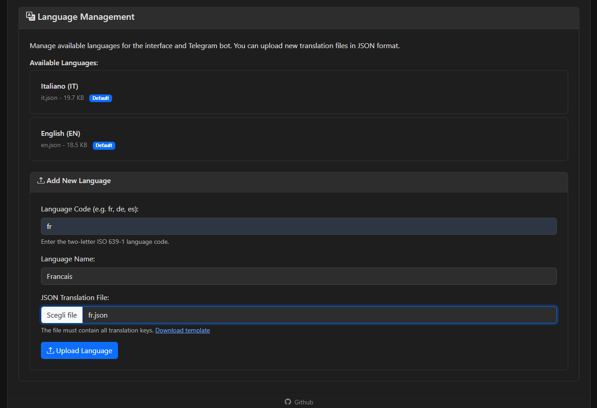
</details>
</div>


---
## 🤖 Telegram Bot Features
Use the Telegram bot to interact with your server directly from your phone or desktop. Below are the main commands for monitoring and control:
- `/start` – Initialize the bot and receive a welcome message.
- `/help` – List all available commands and their descriptions.
- `/res` – Show current system resource usage (CPU, RAM, disk, network).
- `/docker` – View and manage Docker containers (list, start, stop, pause).
- `/upload` – Upload files from Telegram to the configured server directory.
- `/download` – Download files from the server to Telegram.
- `/reboot` – Safely reboot the server.

<div align="center">
   
 ### 📸 TELEGRAM BOT COMMANDS
<details>
   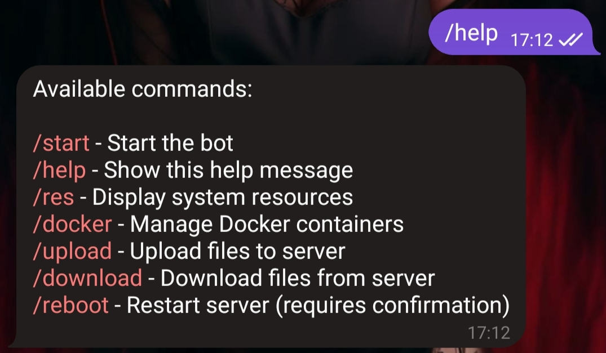
</details>
</div>


### 🛡️ Notifications  
Receive real-time alerts for:  
- SSH/SFTP access  
- CPU, RAM, and temperature thresholds  
- Disk space usage  
- Internet connectivity restoration  


<div align="center">
   
 ### 📸 SSH NOTIFICATION
<details>
   
</details>
</div>


<div align="center">
   
 ### 📸 CPU, CPU_TEMP, RAM & DISK Alert Notification
<details>
   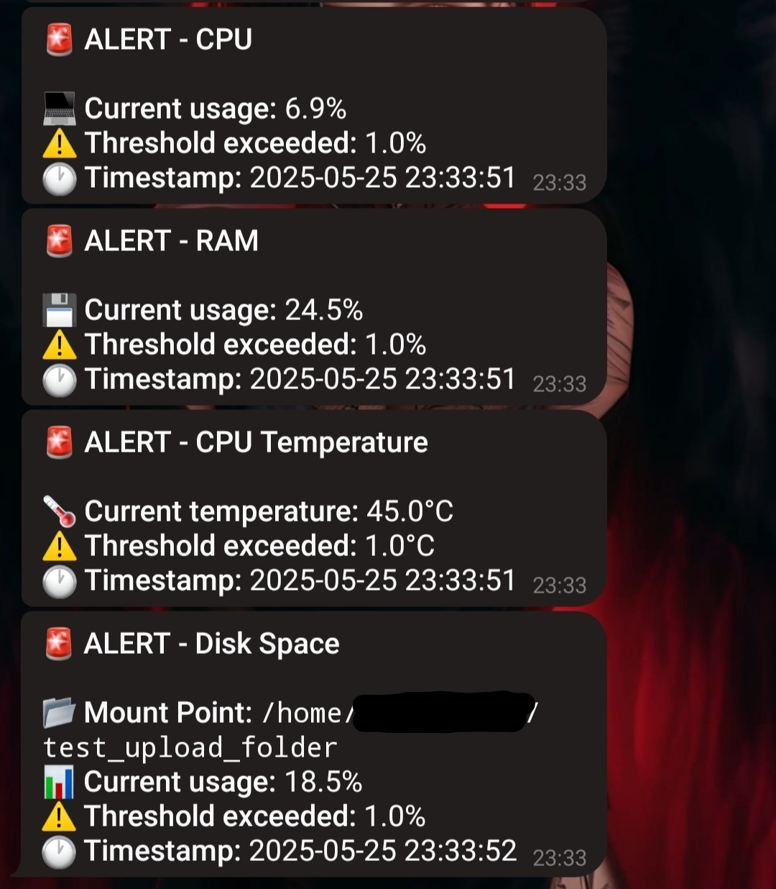
</details>
</div>


<div align="center">
   
 ### 📸 CPU, CPU_TEMP, RAM & DISK Alert Solved
<details>
   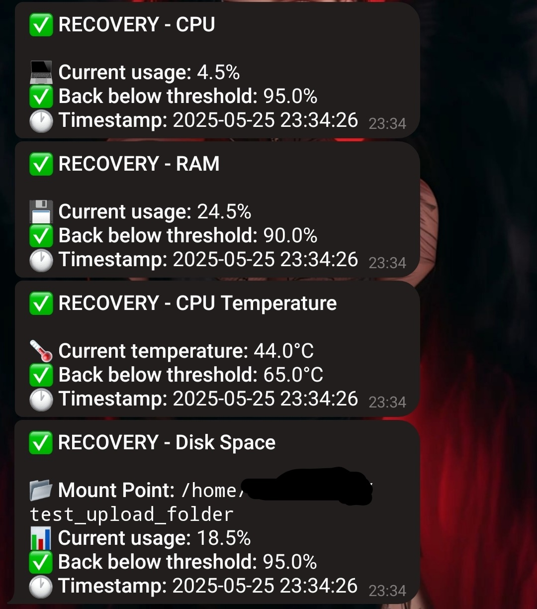
</details>
</div>

### 📊 System Monitoring Commands  
Get current CPU, RAM, disk usage, and network status via bot commands.


<div align="center">
   
 ### 📸 Resource Command
<details>
   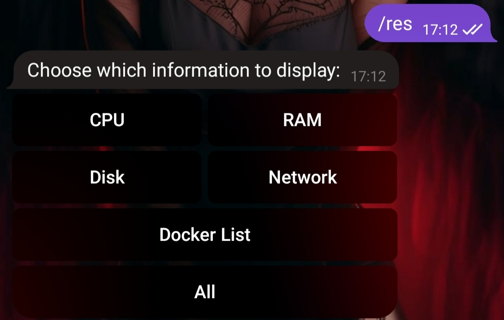
</details>
</div>


<div align="center">
   
 ### 📸 CPU TELEMETRY
<details>
   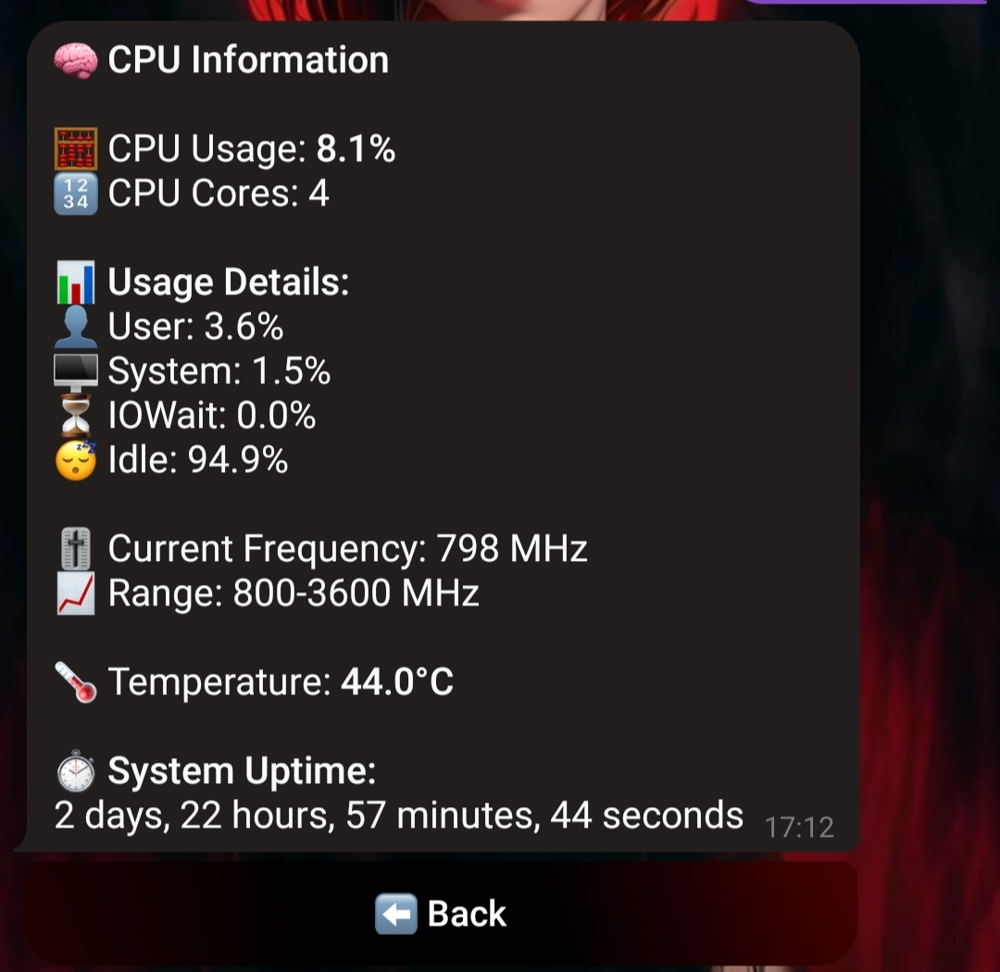
</details>
</div>


<div align="center">
   
 ### 📸 RAM TELEMETRY
<details>
   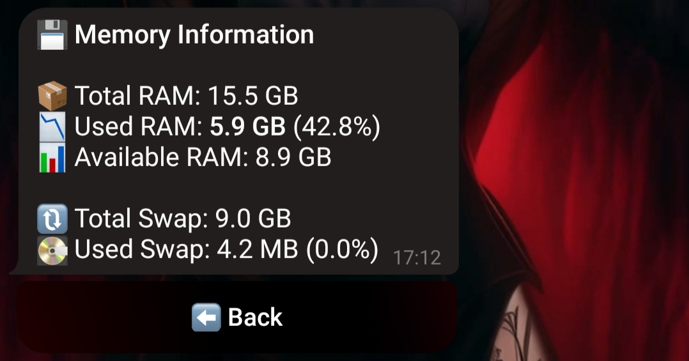
</details>
</div>

<div align="center">
   
 ### 📸 DISK TELEMETRY
<details>
   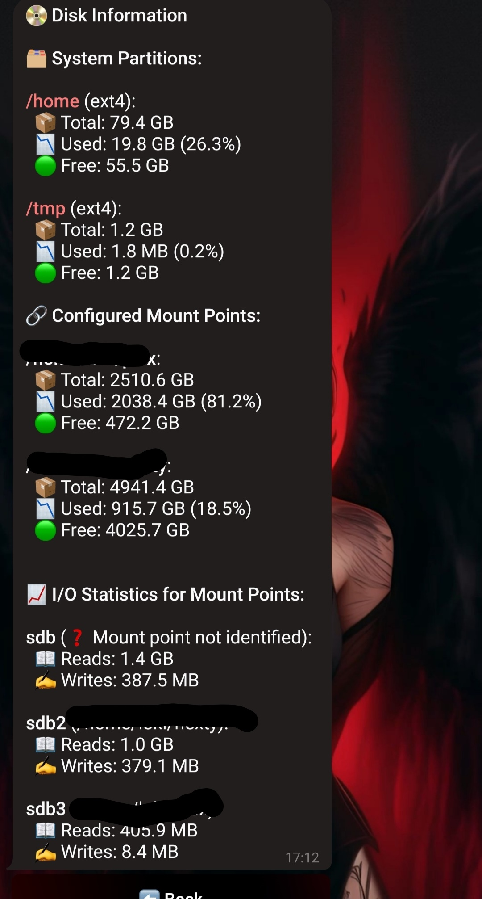
</details>
</div>


<div align="center">
   
 ### 📸 NETWORK TELEMETRY
<details>
   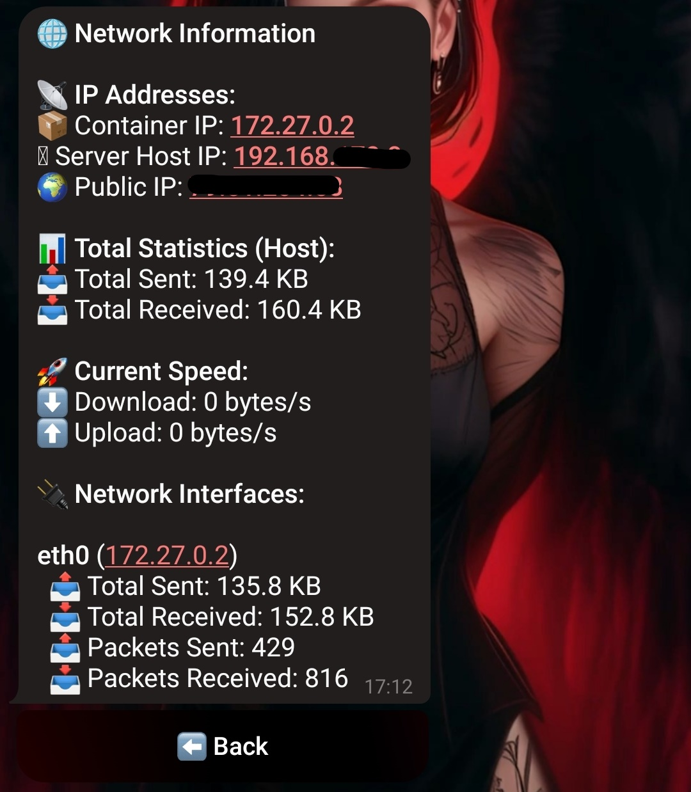
</details>
</div>


<div align="center">
   
 ### 📸 CONTAINER MANAGMENT
<details>
   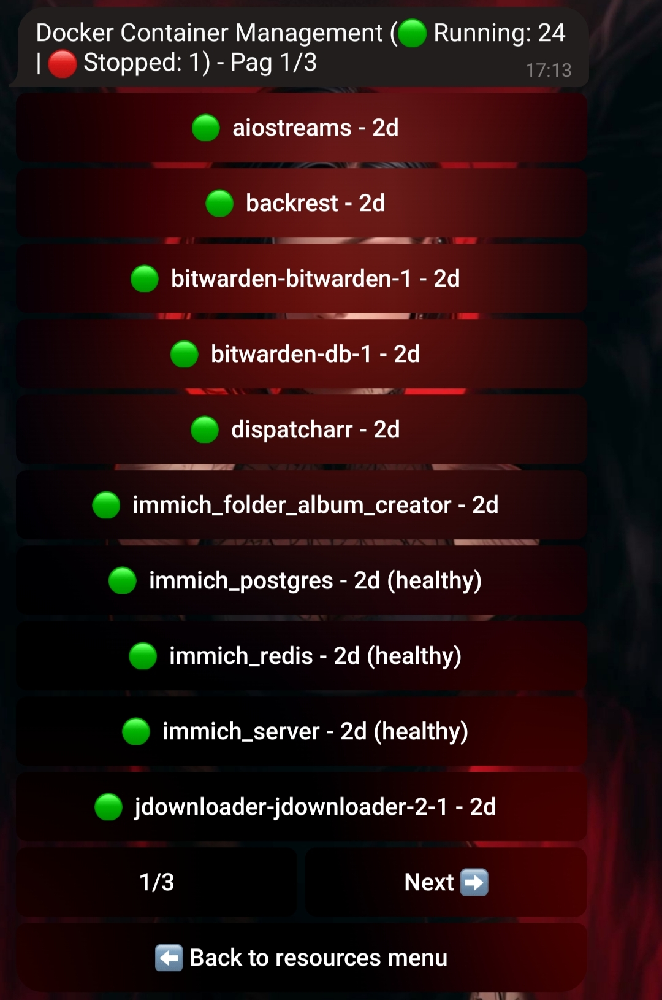
</details>
</div>

### 🐳 Docker Container Management  
- List running containers  
- Start, Pause and Stop containers
- View container configuration

<div align="center">
   
 ### 📸 DOCKER COMMAND
<details>
   
</details>
</div>


<div align="center">
   
 ### 📸 CONTAINER MANAGER
<details>
   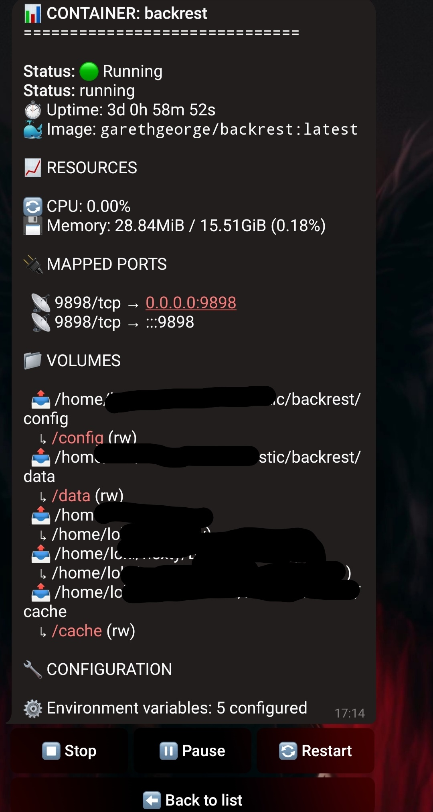
</details>
</div>


### 📂 File Operations  
Upload and download files to/from the server via the configured mount points via the Telegram bot.
 - The  `/upload` command allow to:
       - Navigate between folders
       - Create New Folders
       - Delete Folders
       - Upload files to the Server
 - The  `/download` command allow to:
       - Download files from the Server
   
<div align="center">
   
 ### 📸 UPLOAD COMMAND
<details>
   
</details>
</div>

<div align="center">
   
 ### 📸 DOWNLOAD COMMAND
<details>
   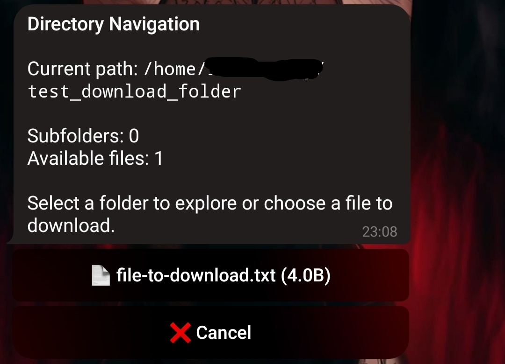
</details>
</div>

### 🔁 Server Control  
Reboot your server using a dedicated bot command.

<div align="center">
   
 ### 📸 REBOOT COMMAND
<details>
   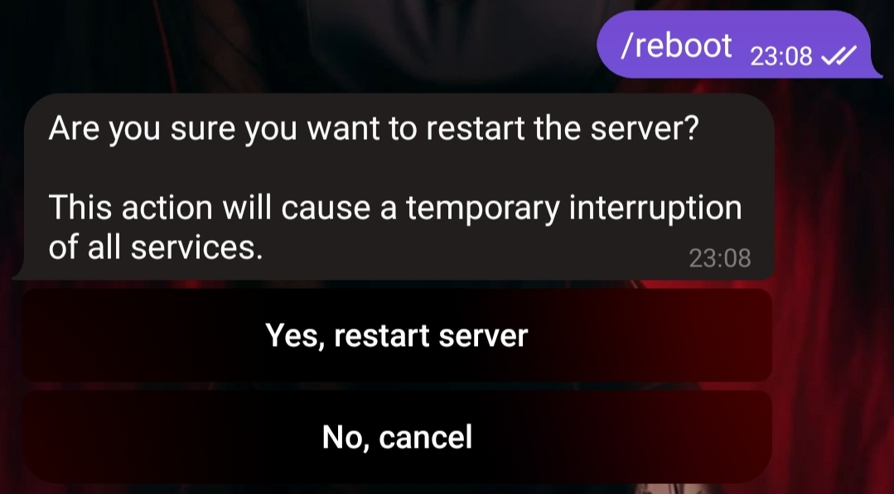
</details>
</div>


---
## 🛠️ Requirements

- Docker and Docker Compose installed on a Linux server (Debian/Ubuntu recommended).
- Telegram Bot Token (create one via [@BotFather](https://t.me/BotFather)).
- Telegram ChatID (get from [@myidbot](https://t.me/IDBot))
---  
## 📦 Installation

1. **Clone the repository**:
   ```bash
   git clone https://github.com/savergiggio/Server-Monitoring-Telegram-Bot-System.git
   cd Server-Monitoring-Telegram-Bot-System

2. **Edit *docker-compose.yml* before running (highly recommended):**:
   
     - *Mount your local directories to be used as mount points in the app, for file upload/download:*
     - *Change the default port mapping (e.g., 8082:5000) if needed to avoid conflicts.*
     - *Set your timezone in the environment variables:*
     - *Specify your local IP address in the config or environment if required for bot communication.*
   
   ```bash
   
    volumes:
    #UPLOADS
       - /home/user/folder1_upload:/home/user/folder1_upload
    #DOWNLOADS
       - /home/user/folder2_download:/home/user/folder2_download
    environment:
       - TZ=Europe/Rome
       - LOCAL_IP=YOURLOCALIP
   
3. **Build and Start the app with Docker Compose:**:
   ```bash
   sudo docker-compose build
   sudo docker-compose up -d
4. **Access the Web GUI in your browser at:**:
   ```bash
   http://localhost:8082 (or your configured IP and port)

